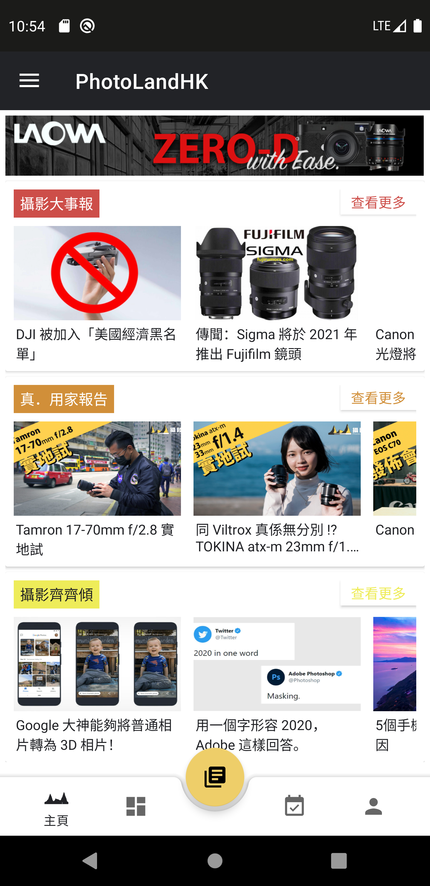

# PhotoLand HK v3

PhotoLandHK is an android app created for photographers to view updates on photolandhk.com through an app with user-friendly interface.

## Table of contents
* [General Info](#general-info)
* [Screenshots](#screenshots)
* [Technologies](#technologies)
<!-- * [Implemented Open-source Library](#implemented-open-source-library) --->
* [Getting Started](#getting-started)
* [Features](#features)
* [Todo list](#todo-list)
* [Contact](#contact)

## General Info
In this app you can view:
* Updated news in the photography industry
* Skills and experiences from photographers of different fields
* Gear review on newly-released gear
* Upcoming events held by photoland.hk

## Screenshots
Home page

Navigation Menu

News Overview Page

	
## Technologies
Project is created with:
* Kotlin version: 1.4.10

<!-- ## Implemented Open-source Library
Project has implemented:
* CarouselView from https://github.com/sayyam/carouselview --->
	
## Getting Started
1.  Pull down the code locally.
2.  Open Android Studio and select 'Open an existing Android Studio Project'
3.  Run the app.

## Features
* User-friendly home page for reading news and navigating to different sections
* Easily accessible on the phone without lanuching the browswer

## Todo list
* Gear review section
* Event calender
* Link to cloud database for real-time updates

## Contact
Created by @darwindev2002 - feel free to contact me!
